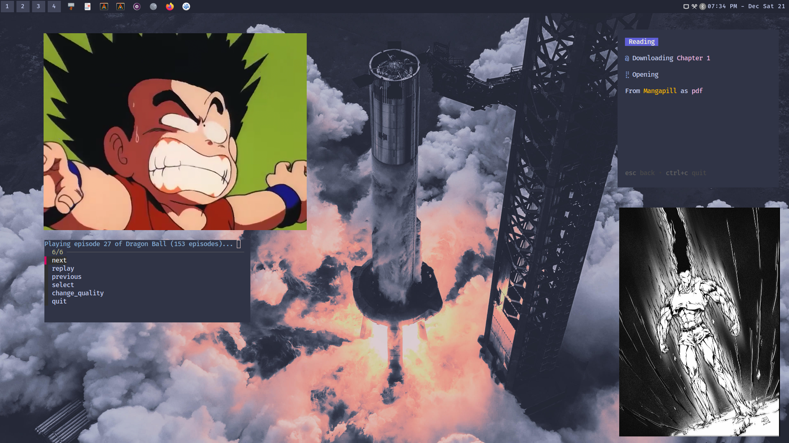

# 🌺 Dotfiles
✏ My Linux Dotfiles using the [Sway Window Manager](https://swaywm.org/)!

- Terminal: [Alacritty](https://alacritty.org/)
- Color Scheme: [Catppuccin Frappe Mauve](https://catppuccin.com)
- Bar: [Waybar](https://github.com/Alexays/Waybar)
- Launcher: [Rofi](https://github.com/davatorium/rofi)
- Anime CLI Tool: [ani-cli](https://github.com/pystardust/ani-cli)
- Manga CLI: [mangal](https://github.com/metafates/mangal)
- Image Viewer: [imv](https://sr.ht/~exec64/imv/)
- Video Player [mpv](https://mpv.io/)
- Wallpapers can be found in the `Wallpapers` folder or [CTP Discord](https://discord.com/servers/catppuccin-907385605422448742) 

